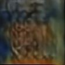
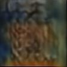

# Model Inversion Attack Demo

## Installation
- Install the environment: `conda create -n MIA-demo python=3.10.14`
- Activate the environment: `conda activate MIA-demo`
- Install the package: `pip install -r requirements.txt`
- The model can be downloaded by [this link](https://drive.google.com/file/d/1a9QTGb9l8WfNqW0gN4b3pHlLyBIqAnZ1/view?usp=sharing)
- The demo dataset can be downloaded by [this link](https://drive.google.com/file/d/1V5Axfe41ypb-UYlM4n_xmItTlkyxO0h7/view?usp=sharing)


## Execution
### Run on a single image: 
- Command: `python main_single.py -t [TARGET_PATH] -a [ATTACK_PATH] -i [INPUT_PATH] -o [OUTPUT_DIR] [-v]`
- For example:

    ```sh
    python main_single.py \
        -t assets/weights/mbf_large_v1.onnx \
        -a assets/weights/attack_idiap_v1.onnx \
        -i assets/images/0.jpg \
        -o assets/outputs
    ```
### Run on a directory containing multiple images:
- Command: `python main_single.py -t [TARGET_PATH] -a [ATTACK_PATH] -i [INPUT_DIR] -o [OUTPUT_DIR] [-v]`
- For example:

    ```sh
    python main_directory.py \
        -t assets/weights/mbf_large_v1.onnx \
        -a assets/weights/attack_idiap_v2.onnx \
        -i assets/images \
        -o assets/outputs/1v2
    ```
## How it works
The program will feed the original image to the **target model** and receive a **feature map**, which is visualized as a heat map. Then, the feature map will be the input of the **attack model**, and output the reconstructed image.


In the verbose mode (add `-v` in the argument) will save the original, feature map and reconstructed image in single files rather than combine them in one figure.
|Original Image | Feature Map | Reconstructed Image|
|:-:|:-:|:-:|
| || |

# Models
There are three type of target models: `mbf_large_v1`, `mbf_large_v2` and `mbf_large_v3`.
- mbf_large is stand for ***Mobile Facenet*** (large version).
- v1 is the original version of mobile facenet.
- v2 is DP-preserverd by adding noise in somewhere of the model
- v3 is DP-preserverd by adding noise in frequenct domain (actually, discrete cosine transform)
- The protection power is `v1 < v2 < v3`

There is only one attack model which is from [this paper](https://ieeexplore.ieee.org/abstract/document/9897535) called idiap.
- idiap has specificity
- This mean an attack model trained on v1 cannot attack the feature produced by v2.
- Here is a demo of the result

| Target Model | mbf_large_v1 | mbf_large_v2 | mbf_large_v3 |
| :----------: | :----------: | :----------: | :----------: |
|Original||||
|Attack by idiap_v1||||
|Attack by idiap_v2||||
|Attack by idiap_v3||||

 
