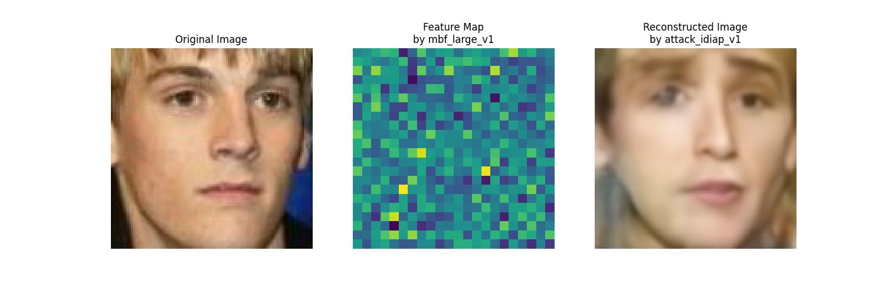
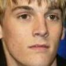
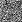
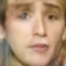

# Model Inversion Attack Demo

## Installation
- Install the environment: `conda create -n MIA-demo python=3.10.14`
- Activate the environment: `conda activate MIA-demo`
- Install the package: `pip install -r requirements.txt`

## Execution
### Run on a single image: 
- Command: `python main_single.py -t [TARGET_PATH] -a [ATTACK_PATH] -i [INPUT_PATH] -o [OUTPUT_DIR] [-v]`
- For example:

    ```sh
    python main_single.py \
        -t assets/weights/mbf_large_v1.onnx \
        -a assets/weights/attack_idiap_v1.onnx \
        -i assets/images/0.jpg \
        -o assets/outputs
    ```
### Run on a directory containing multiple images:
- Command: `python main_single.py -t [TARGET_PATH] -a [ATTACK_PATH] -i [INPUT_DIR] -o [OUTPUT_DIR] [-v]`
- For example:

    ```sh
    python main_directory.py \
        -t assets/weights/mbf_large_v1.onnx \
        -a assets/weights/attack_idiap_v2.onnx \
        -i assets/images \
        -o assets/outputs/1v2
    ```
## How it works
The program will feed the original image to the **target model** and receive a **feature map**, which is visualized as a heat map. Then, the feature map will be the input of the **attack model**, and output the reconstructed image.



In the verbose mode (add `-v` in the argument) will save the original, feature map and reconstructed image in single files rather than combine them in one figure.
|Original Image | Feature Map | Reconstructed Image|
|:-:|:-:|:-:|
| || |


 
